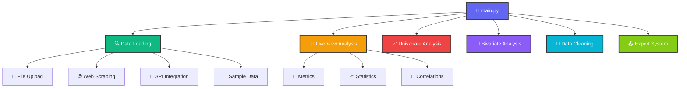
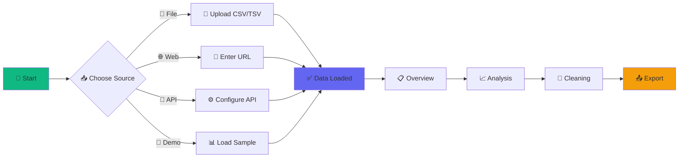

<div align="center">

# 📊 InsightForge — EDA Dashboard

**A comprehensive Exploratory Data Analysis dashboard built with Streamlit**

*Analyze datasets quickly with interactive Overview, Univariate, and Bivariate visualizations — all in your browser with multiple data source options.*

[](https://python.org)
[](https://streamlit.io)
[](LICENSE)
[](https://insightforge-eda-dashboard-streamlit-1.onrender.com/)

</div>

---

## 🌟 Features Overview

<table>
  <tr>
    <td align="center" width="33%">
      
      <h3>📊 Dataset Overview</h3>
      <p>Comprehensive data profiling with statistics, correlations, and missing value analysis</p>
    </td>
    <td align="center" width="33%">
      
      <h3>📈 Univariate Analysis</h3>
      <p>Single variable exploration with interactive histograms, box plots, and distribution analysis</p>
    </td>
    <td align="center" width="33%">
      
      <h3>🔀 Bivariate Analysis</h3>
      <p>Relationship exploration between variables with scatter plots, heatmaps, and correlation analysis</p>
    </td>
  </tr>
</table>

---

## 🚀 Live Demo & Quick Start

<div align="center">

### 🌐 Try it Live!
**No installation required — start analyzing your data immediately in your browser!**

[](https://insightforge-eda-dashboard-streamlit-1.onrender.com/)

*or*

### 💻 Run Locally

```bash
# 📥 Clone the repository
git clone https://github.com/ShaikhHamza104/InsightForge-EDA-Dashboard-Streamlit-.git
cd InsightForge-EDA-Dashboard-Streamlit-

# 📦 Install dependencies
pip install -r requirements.txt

# 🚀 Launch the app
streamlit run main.py
```

</div>

---

## 🏗️ Project Architecture

<div align="center">



</div>

### 📂 Directory Structure

```
📁 InsightForge-EDA-Dashboard/
├── 🚀 main.py                    # Main application entry point
├── 📋 requirements.txt           # Python dependencies
├── ⚙️ Procfile                   # Deployment configuration
├── 📖 README.md                  # Project documentation
├── 📄 LICENSE                    # MIT License
├── 🐍 .python-version           # Python version specification
├── 🚫 .gitignore                # Git ignore rules
├──
├── # 🔧 Core Analysis Modules
├── 📊 univariate_analysis.py     # Single variable analysis
├── 📈 bivariate_analysis.py      # Two variable relationship analysis
├── 📋 overview.py                # Dataset overview wrapper
├── 🧹 basic_data_clean.py        # Data cleaning wrapper
├── 📤 data_export.py             # Export functionality
├──
├── # 📦 Modular Components
├── 📁 components/
│   ├── 🏷️ __init__.py           # Package initialization
│   ├── 🎨 styles.css            # Custom CSS styling
│   ├── 👋 welcome.py            # Welcome screen component
│   ├── 💾 state.py              # Session state management
│   ├── 📊 metrics.py            # Dataset metrics display
│   ├── 📥 load_data.py          # Multi-source data loading
│   ├── 📤 export_ui.py          # Export interface
│   ├──
│   ├── 📋 overview/             # Overview analysis module
│   │   ├── 🏷️ __init__.py
│   │   ├── 👁️ view.py           # Main overview class
│   │   ├── 📑 sections.py       # Individual overview sections
│   │   └── 🔧 helpers.py        # Cached computation helpers
│   ├──
│   └── 🧹 cleaning/             # Data cleaning module
│       ├── 🏷️ __init__.py
│       ├── 👁️ view.py           # Main cleaning interface
│       ├── 📑 sections.py       # Cleaning UI sections
│       └── 🔧 helpers.py        # Cleaning utility functions
├──
├── ⚙️ .streamlit/
│   └── 🔧 config.toml           # Streamlit configuration
├──
└── 💾 __pycache__/              # Python bytecode cache
```

---

## ✨ Key Features & Capabilities

### 🔍 **Advanced Data Loading System**
<div align="center">

| Feature | Description | Status |
|---------|-------------|--------|
| 📁 **File Upload** | CSV/TSV with automatic encoding detection | ✅ Ready |
| 🌐 **Web Scraping** | Extract HTML tables from URLs | ✅ Ready |
| 🔗 **API Integration** | JSON data fetching with custom headers | ✅ Ready |
| 🧪 **Sample Dataset** | Pre-loaded laptop dataset for testing | ✅ Ready |
| ⚡ **Smart Caching** | Intelligent data caching for performance | ✅ Ready |

</div>

### 📊 **Comprehensive Analysis Suite**

<details>
<summary><strong>📋 Overview Analysis</strong> (Click to expand)</summary>

- 📐 **Dataset Metrics**: Shape, memory usage, missing values
- 📈 **Statistical Summary**: Cached descriptive statistics
- ⚠️ **Missing Value Analysis**: Visual charts and breakdowns
- 🧬 **Data Type Distribution**: Interactive visualizations
- 🔗 **Correlation Matrix**: Smart filtering and analysis
- 🔠 **Categorical Analysis**: Value counts with limits

</details>

<details>
<summary><strong>📈 Univariate Analysis</strong> (Click to expand)</summary>

#### 🔢 Numerical Variables
- 📊 **Histogram**: Distribution visualization
- 📦 **Box Plot**: Outlier detection
- 📈 **Line Plot**: Trend analysis
- 🎯 **Scatter Plot**: Data point distribution
- 🌊 **Density Plot**: Smooth distribution curves

#### 🏷️ Categorical Variables
- 📊 **Count Plot**: Frequency visualization
- 🥧 **Pie Chart**: Proportion analysis
- 📊 **Bar Plot**: Comparative visualization

</details>

<details>
<summary><strong>🔀 Bivariate Analysis</strong> (Click to expand)</summary>

#### 📊 Numerical vs Numerical
- 🎯 **Scatter Plot**: Correlation visualization
- 📈 **Line Plot**: Trend analysis
- 📦 **Box Plot**: Distribution comparison
- 🌊 **Density Plot**: Pattern analysis
- 🔥 **Heatmap**: Correlation matrix

#### 🏷️ Categorical vs Categorical
- 📊 **Grouped Bars**: Category comparison
- 🔥 **Cross-tabulation Heatmap**: Relationship matrix

#### 🔀 Numerical vs Categorical
- 📦 **Box Plot**: Distribution by category
- 🎻 **Violin Plot**: Density by category
- 📊 **Mean Comparison**: Average analysis

</details>

### 🧹 **Advanced Data Cleaning**

<div align="center">

| Cleaning Method | Numerical | Categorical | Advanced |
|----------------|-----------|-------------|----------|
| 📊 **Mean/Median/Mode** | ✅ | ✅ | - |
| 🎯 **Custom Values** | ✅ | ✅ | - |
| 🤖 **KNN Imputation** | ✅ | ✅ | ⭐ |
| 🔬 **FancyImpute** | ✅ | ✅ | ⭐⭐ |
| 🗑️ **Column Dropping** | ✅ | ✅ | - |
| 📊 **High Missing Detection** | ✅ | ✅ | ⭐ |

</div>

### 📤 **Export & Download Options**

<div align="center">

| Format | Features | Use Case |
|--------|----------|----------|
| 📄 **CSV** | Custom separators, encoding | Data analysis |
| 📋 **TSV** | Tab-separated values | Database import |
| 🔗 **JSON** | Multiple orientations | Web APIs |
| 📈 **Excel** | Multi-sheet support | Business reports |

</div>

---

## 🛠️ Technology Stack

<div align="center">

### Frontend & Framework
[](https://streamlit.io)
[](https://developer.mozilla.org/en-US/docs/Web/HTML)
[](https://developer.mozilla.org/en-US/docs/Web/CSS)

### Data Processing
[](https://pandas.pydata.org)
[](https://numpy.org)
[](https://scipy.org)

### Visualization
[](https://plotly.com)
[](https://matplotlib.org)
[](https://seaborn.pydata.org)

### Machine Learning
[](https://scikit-learn.org)

### Development
[](https://python.org)
[](https://git-scm.com)
[](https://github.com)

</div>

---

## 📋 Installation & Dependencies

### 🚀 Quick Installation

```bash
# 📦 Core dependencies (required)
pip install streamlit pandas numpy plotly matplotlib seaborn scikit-learn

# 🌐 Web scraping & API support
pip install requests lxml beautifulsoup4

# 🔬 Advanced features (optional)
pip install fancyimpute knnimpute
```

### 📄 Requirements Breakdown

<details>
<summary><strong>🔧 Core Requirements</strong> (Click to expand)</summary>

```txt
# 📊 Data & Computing
pandas>=2.3.2           # Data manipulation and analysis
numpy>=2.3.2            # Numerical computing foundation
streamlit>=1.49.1       # Web application framework

# 📈 Visualization
plotly>=5.24.1          # Interactive visualizations
matplotlib>=3.10.6      # Statistical plotting
seaborn>=0.13.2         # Enhanced statistical visualizations

# 🤖 Machine Learning & Processing
scikit-learn            # KNN imputation and preprocessing
scipy                   # Scientific computing
statsmodels             # Statistical modeling

# 🌐 Web & Data Fetching
requests>=2.32.5        # HTTP requests for APIs/URLs
lxml>=4.9.0             # HTML/XML parsing for web scraping
```

</details>

<details>
<summary><strong>⭐ Optional Advanced Features</strong> (Click to expand)</summary>

```txt
# 🔬 Advanced Imputation (Optional)
fancyimpute             # Sophisticated missing value imputation
knnimpute               # Enhanced KNN imputation methods

# ⚡ Optimization (Optional)
cvxpy                   # Convex optimization
cvxopt                  # Optimization algorithms
osqp                    # Quadratic programming
scs                     # Conic optimization

# 🛠️ Utilities
joblib                  # Efficient data persistence
altair                  # Alternative visualization library
openpyxl                # Excel file support
```

</details>

---

## 🎯 Usage Examples & Workflows

### 📊 Data Loading Workflow

<div align="center">



</div>

### 🔍 Analysis Pipeline

1. **📥 Data Ingestion**
   ```python
   # Multiple source options
   - File Upload: CSV/TSV with encoding detection
   - Web Scraping: HTML tables from URLs
   - API Integration: JSON endpoints
   - Sample Data: Pre-loaded datasets
   ```

2. **📊 Exploratory Analysis**
   ```python
   # Comprehensive data profiling
   - Dataset metrics and statistics
   - Missing value analysis
   - Data type distribution
   - Correlation analysis
   ```

3. **📈 Variable Analysis**
   ```python
   # Single and multi-variable exploration
   - Univariate: Individual variable patterns
   - Bivariate: Relationship analysis
   - Interactive visualizations
   ```

4. **🧹 Data Preparation**
   ```python
   # Advanced cleaning capabilities
   - Missing value imputation
   - Outlier detection
   - Column management
   - Quality assessment
   ```

5. **📤 Results Export**
   ```python
   # Multiple format support
   - CSV/TSV with custom options
   - JSON with different orientations
   - Excel workbooks
   - Advanced configurations
   ```

---

## ⚙️ Configuration & Deployment

### 🔧 Streamlit Configuration

<details>
<summary><strong>📄 .streamlit/config.toml</strong> (Click to expand)</summary>

```toml
[server]
headless = true
enableCORS = false
enableXsrfProtection = false
port = 8501
maxUploadSize = 200
maxMessageSize = 200

[browser]
gatherUsageStats = false

[logger]
level = "error"

[theme]
primaryColor = "#6366f1"
backgroundColor = "#ffffff"
secondaryBackgroundColor = "#f8fafc"
textColor = "#1e293b"
font = "sans serif"

[client]
toolbarMode = "minimal"

[runner]
magicEnabled = true
```

</details>

### 🚀 Deployment Options

<div align="center">

| Platform | Configuration | Status |
|----------|---------------|--------|
| 🌊 **Render** | `Procfile` included | ✅ Ready |
| 🎈 **Streamlit Cloud** | Native support | ✅ Ready |
| 🐳 **Docker** | Dockerfile available | 🔄 Coming Soon |
| ☁️ **Heroku** | Buildpack compatible | ✅ Ready |

</div>

---

## 🤝 Contributing & Community

### 🎯 How to Contribute

<div align="center">

[](CONTRIBUTING.md)
[](https://github.com/ShaikhHamza104/InsightForge-EDA-Dashboard-Streamlit-/issues)
[](https://github.com/ShaikhHamza104/InsightForge-EDA-Dashboard-Streamlit-/pulls)

</div>

1. **🍴 Fork** the repository
2. **🌿 Create** a feature branch (`git checkout -b feature/AmazingFeature`)
3. **💻 Commit** your changes (`git commit -m 'Add some AmazingFeature'`)
4. **📤 Push** to the branch (`git push origin feature/AmazingFeature`)
5. **🔀 Open** a Pull Request

### 🐛 Report Issues

Found a bug? Have a feature request? 

[](https://github.com/ShaikhHamza104/InsightForge-EDA-Dashboard-Streamlit-/issues/new?labels=bug)
[](https://github.com/ShaikhHamza104/InsightForge-EDA-Dashboard-Streamlit-/issues/new?labels=enhancement)

---

## 📞 Contact & Support

<div align="center">

### 👨‍💻 Created by [Shaikh Hamza](https://github.com/ShaikhHamza104)

[](https://github.com/ShaikhHamza104)
[](https://linkedin.com/in/shaikhhamza104)
[](mailto:your.email@example.com)

### 🔗 Project Links

[](https://insightforge-eda-dashboard-streamlit-1.onrender.com/)
[](https://github.com/ShaikhHamza104/InsightForge-EDA-Dashboard-Streamlit-)
[](README.md)

</div>

---

## 📊 Project Stats

<div align="center">


</div>

---

## 📄 License

<div align="center">

This project is licensed under the **MIT License** - see the [`LICENSE`](LICENSE) file for details.

[](https://opensource.org/licenses/MIT)

</div>

---

<div align="center">

## 🌟 Star History

[](https://star-history.com/#ShaikhHamza104/InsightForge-EDA-Dashboard-Streamlit-&Date)

</div>

---

<div align="center">

### 🚀 Ready to Explore Your Data?

[](https://insightforge-eda-dashboard-streamlit-1.onrender.com/)

### ⭐ Show Your Support

**If this project helped you, please consider giving it a star!**

[](https://GitHub.com/ShaikhHamza104/InsightForge-EDA-Dashboard-Streamlit-/stargazers/)

---

*Built with ❤️ using Python, Streamlit, and modern data science libraries*

**📊 InsightForge — Transform Data into Insights**

</div>